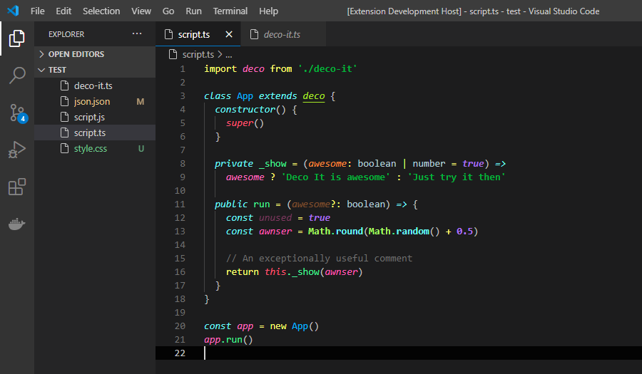
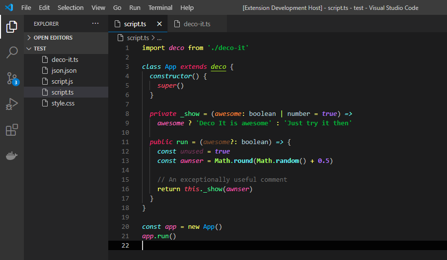
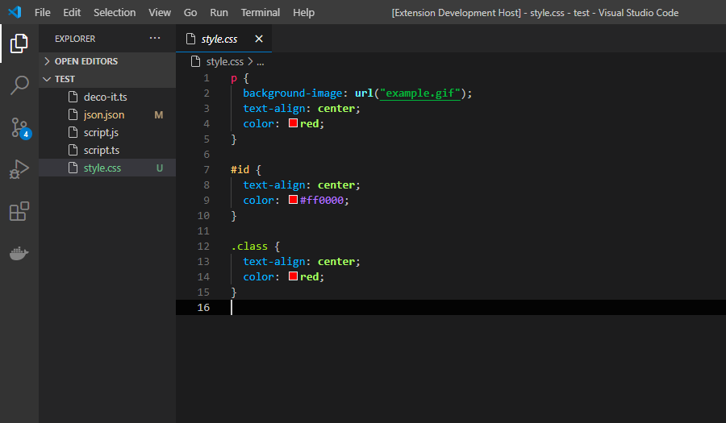
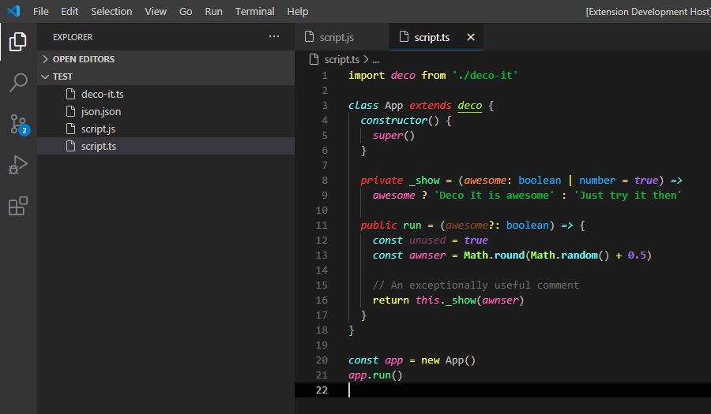
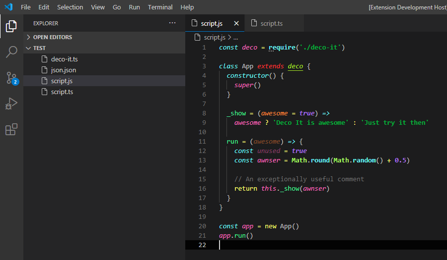
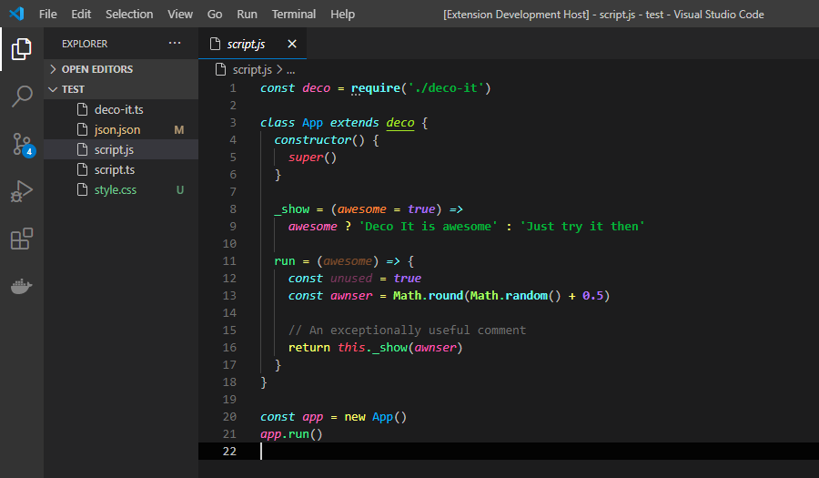
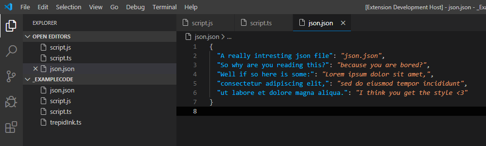
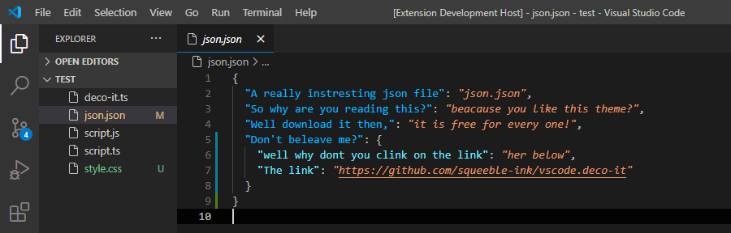

# Change Log

## [[v1.1.1] - 23/12/2020](https://github.com/squeeble-ink/vscode.deco-it/releases/tag/v1.1.1)

### Revered

- color highlighting modifier to v.1.0.0
  - old ts   
  - new ts   

## [[v1.1.0] - 23/12/2020](https://github.com/squeeble-ink/vscode.deco-it/releases/tag/v1.1.0)

### Added

- README

  - logo
  - old trepid-ink project

- Package tags

  - deco
  - deco it
  - deco-it

- CSS Test file

  - 

### Updated

- README images
- CHANGELOG
- color highlighting

  - old ts   
  - new ts   
  - old js   
  - new js   
  - old json 
  - new json 

## [[v1.0.3] - 29/08/2020](https://github.com/squeeble-ink/vscode.deco-it/releases/tag/v1.0.2)

### Added

- README badges

  - issues
  - version
  - instals

- Package tags

  - decorate
  - decorate it
  - decorate-it

## [[v1.0.2] - 29/08/2020](https://github.com/squeeble-ink/vscode.deco-it/releases/tag/v1.0.2)

### Updated

- README alt names for images
- CHANGELOG alt names for images

## [[v1.0.1] - 29/08/2020](https://github.com/squeeble-ink/vscode.deco-it/releases/tag/v1.0.1)

### Updated

- README title from `vscode.code-it` to `deco-it`

## [v1.0.0] - 29/08/2020 - Initial release

  
  

