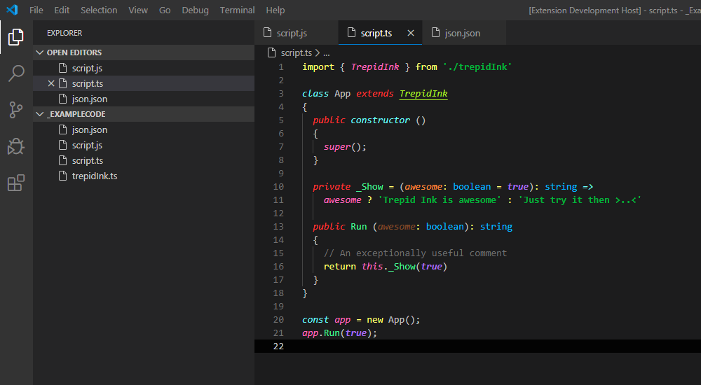

# vscode.code-it

[vscode](https://code.visualstudio.com/) color theme : just decorate it

The theme `deco-it` is inspired from our [`trepid-ink`](https://github.com/squeeble-ink/vscode.trepid-ink/edit/master/README.md)

  

