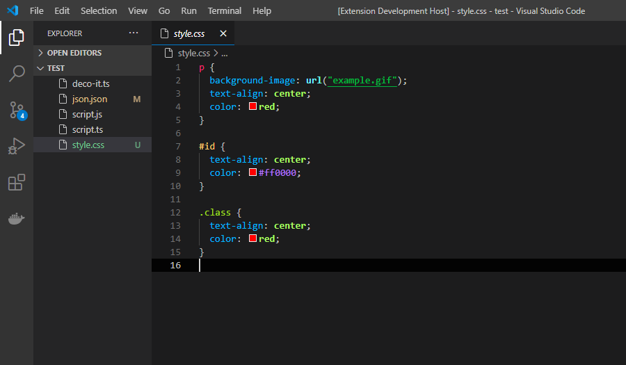
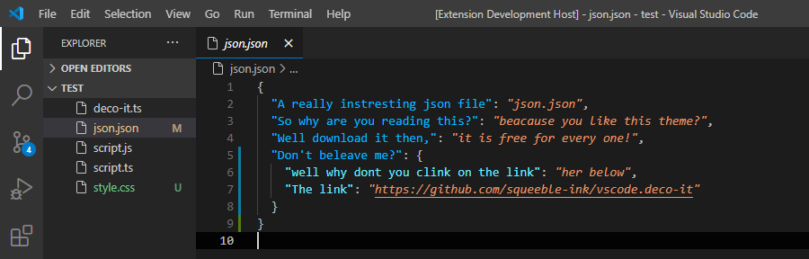

   

<h1 align="center">Decorate it</h1>
 

  
  
  
   
  <a href="https://code.visualstudio.com/" >vscode</a> color theme : just decorate it

<h1></h1>
<h1></h1>

  previous known as

<h1 align="center">Trepid ink</h1>

    
     
    <code>trepid-ink</code> is the predecessor of this theme <code>deco-it</code> 
    <code>trepid-ink</code> is <b>deprecated</b>

  
  
  

